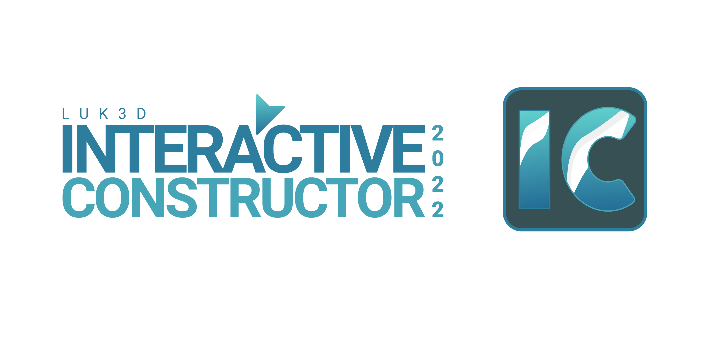
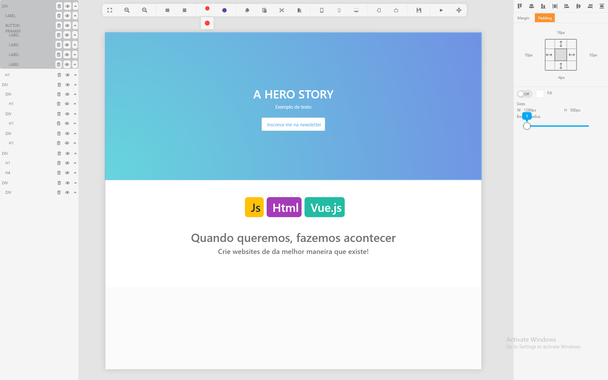
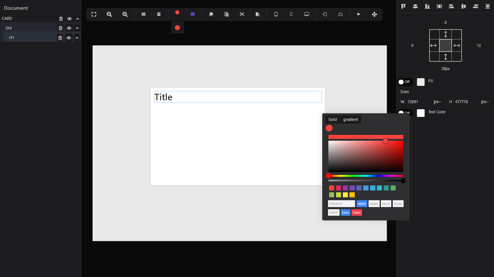
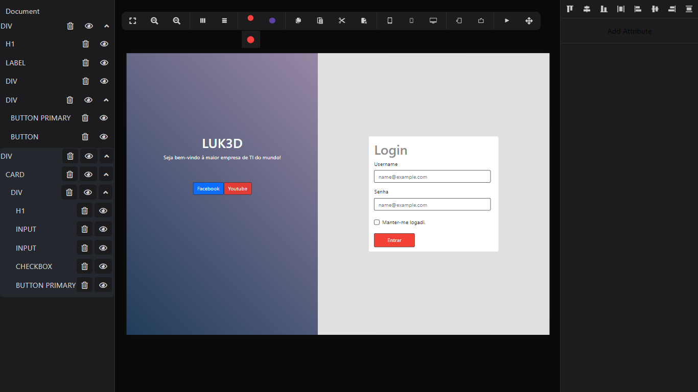
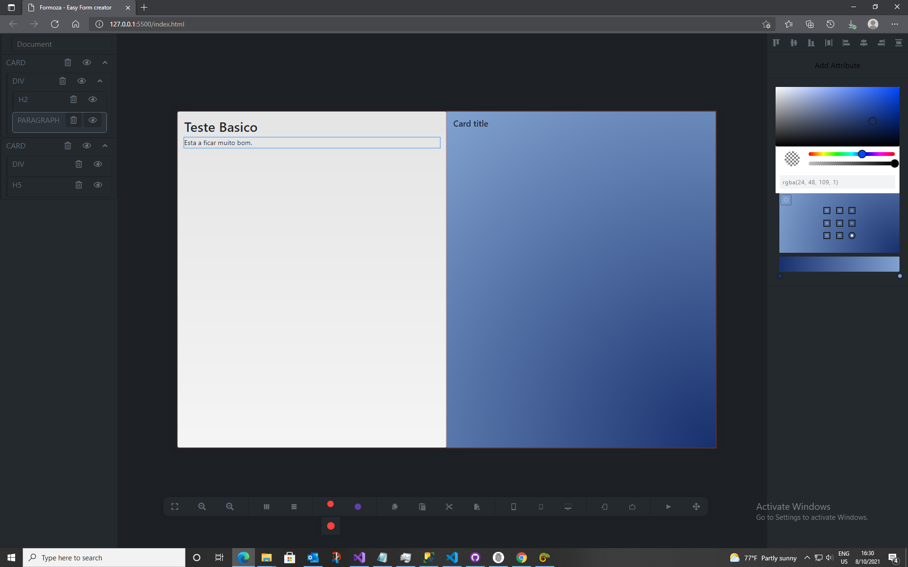
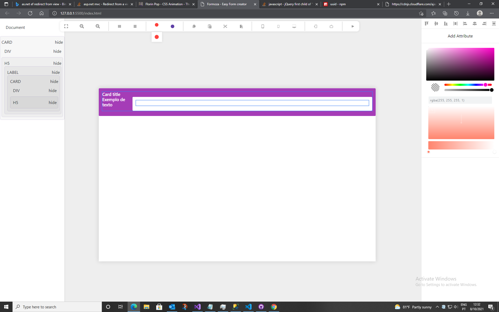

# LUK3D INTERACTIVE CONSTRUCTOR (LIC)

Construtor interativo de páginas web.

O construtor interativo de páginas web, é um projeto desenvolvido pela LUK3D na pessoa de Filipe Lukebana.
O seu objectivo é muito simples: Criar o front-end do teu website de forma rápida e simples. Posteriormente será integrado com o [Okyhub (Gerador de APIs)](http://okyhub.luk3d.com/#/)  para que se crie o front-end e back-end ao mesmo tempo e sem muita complexidade.

#UPDATES

> Este é um exemplo de UI criado com o LIC.

#UPDATES

> Este é um exemplo de UI criado com o LIC.

> Este é um exemplo de formulário de login criado com o LIC.

* Adicionado novos atributos (Background, Text color, Width x Height).
* Adicionado Select com as medidas mais utilizadas no css (px, %, vw, vh).
* Implementado a possibilidade de alterar o valor dos input numérico movendo o mouse enquanto clica por cima do imput.
* Foram adicionados os helpers css com seletores customizados.

> Este é um exemplo de formulário de login criado com o LIC

* Dark mode
* Css Variables
* UUID para distinguir cada elemento dentro do projecto
* Menu superior arrastável
* sincronização do autline (hierarquia) com a workspace 

> Este é um exemplo de formulário de login criado com o LIC

## Como Iniciar?
Para inicar o projecto você presica de um servidor. Para isso, instale  a extensão Live Server no VSCode ou então adicione o projecto na raiz do seu servidor php e sirva...

## Usando um servidor PHP
Caso tenha o php instalado em sua máquina, siga os seguintes passos:
- Abra a pasta do projecto no cmd
- digite "php -S localhost:2121"
- Abra o navegador e navegue na url http://localhost:2121

Documentação brevemente....
