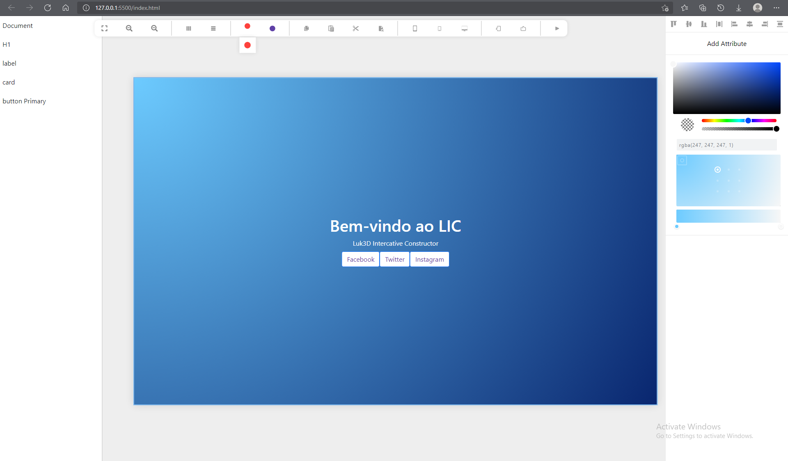

# LUK3D INTERACTIVE CONSTRUCTOR (LIC)

Construtor interativo de páginas web.

> Este é um exemplo de formulário de login criado com o LIC

O construtor interativo de páginas web, é um projeto desenvolvido pela LUK3D na pessoa de Filipe Lukebana.
O seu objectivo é muito simples: Criar o front-end do teu website de forma rápida e simples. Posteriormente será integrado com o [Okyhub (Gerador de APIs)](http://okyhub.luk3d.com/#/)  para que se crie o front-end e back-end ao mesmo tempo e sem muita complexidade.

## Como Iniciar?
Para inicar o projecto você presica de um servidor. Para isso, instale  a extensão Live Server no VSCode ou então adicione o projecto na raiz do seu servidor php e sirva...

Documentação brevemente....
